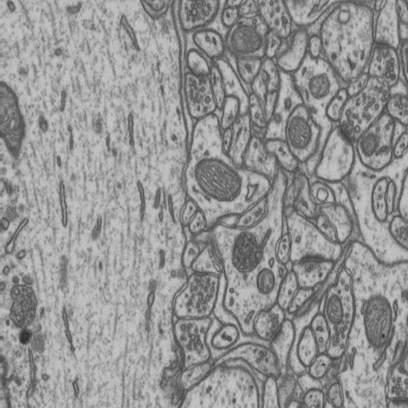
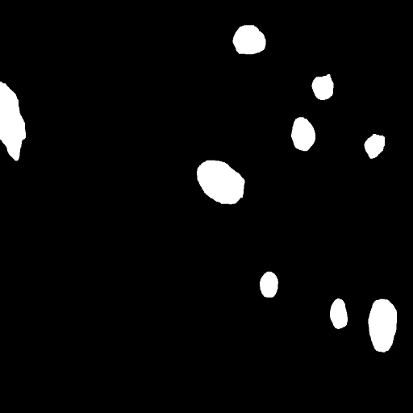
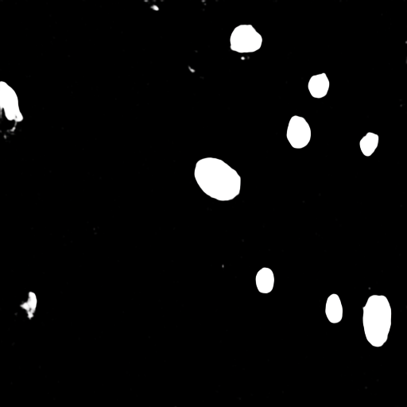

FusionNet with examples in Lucchi++ dataset
=====

## Example

From top to bottom: original input, manual labels by experts and generated results by FusionNet [1].
Data are from Lucchi++ dataset [2].

## References
_[1] Quan, T. M., Hildebrand, D. G., & Jeong, W. K. (2016). Fusionnet: A deep fully residual convolutional neural network for image segmentation in connectomics. arXiv preprint arXiv:1612.05360._

_[2] Casser, V., Kang, K., Pfister, H., Haehn, D. (2018). Fast Mitochondria Segmentation for Connectomics. arXiv preprint arXiv:1812.06024._
